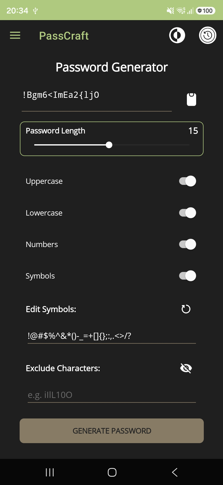
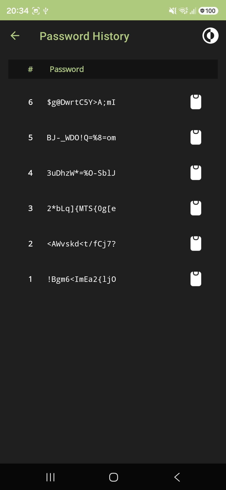

# PassCraft

PassCraft is a modern, lightweight, and secure password generator application built with .NET MAUI. It empowers users to create highly customized, random character sequences while providing advanced control over character pools and exclusion rules.

## Key Features

- **Customizable Generation**: Configure length, character sets (Uppercase, Lowercase, Numbers, Symbols).
- **Advanced Filtering**: Exclude specific characters to ensure compatibility or readability.
- **Smart Ambiguity Tool**: One-tap quick-fill to exclude visually similar characters (like `i`, `l`, `1`, `O`, `0`).
- **Secure History**: Automatically track and review previously generated passwords.
- **Modern UI**: Built with .NET MAUI, supporting both Light and Dark modes.

## Screenshots

## Architecture

PassCraft follows a clean, decoupled architecture:
- **UI Layer**: .NET MAUI views for a cross-platform responsive interface.
- **Core Engine**: A dedicated `IPasswordGenerationService` for high-entropy random sequence generation.
- **History Service**: Persistent storage for tracking generated passwords.

## Tech Stack

- **Framework**: .NET MAUI
- **Language**: C#
- **Toolkit**: CommunityToolkit.Maui
- **Design**: SVG-based iconography for consistent theme support

## Contributing

We welcome contributions! Please feel free to open issues or submit pull requests for new features or bug fixes.

---
*Built with ❤️ for secure and efficient password management.*