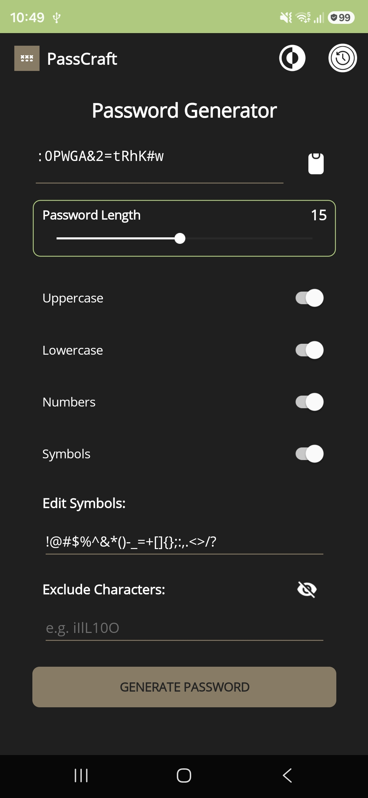

# PassCraft

PassCraft is a modern, lightweight, and secure password generator application built with .NET MAUI. It empowers users to create highly customized, random character sequences while providing advanced control over character pools and exclusion rules.

## Key Features

- **Customizable Generation**: Configure length, character sets (Uppercase, Lowercase, Numbers, Symbols).
- **Advanced Domain Validation**: Real-time evaluation prevents empty character pools and dynamically toggles controls.
- **Smart Adaptive UI**: Interface buttons (like Reset Symbols and Exclude Ambiguous) contextually show or hide themselves when text sets match target references, stripping out duplicates and ignoring sorting orders.
- **Advanced Filtering**: Exclude specific characters to ensure compatibility or readability.
- **Smart Ambiguity Tool**: One-tap quick-fill to exclude visually similar characters (like `i`, `l`, `1`, `O`, `0`).
- **Secure History**: Automatically track and review previously generated passwords.
- **Modern UI**: Built with .NET MAUI, supporting both Light and Dark modes with an integrated brand asset header that completely replaces the flyout hamburger menu layout.

## Screenshots

   

## Architecture

PassCraft follows a clean, decoupled, and highly testable architecture:
- **UI Layer**: .NET MAUI views using code-behind events mapped directly to underlying decoupled engines.
- **Validation Domain Engine**: A dedicated `IPasswordValidationService` handling pool viability calculations and set-equivalence checks for UI states.
- **Core Engine**: A dedicated `IPasswordGenerationService` for high-entropy random sequence generation.
- **History Service**: Persistent storage orchestrator tracking and formatting generated password items.

## Tech Stack

- **Framework**: .NET 10.0 / .NET MAUI
- **Language**: C#
- **Testing Ecosystem**: xUnit / Coverlet
- **Toolkit**: CommunityToolkit.Maui
- **Design**: Fixed track grid sizing with SVG-based iconography for consistent light/dark theme support

## Contributing

We welcome contributions! Please feel free to open issues or submit pull requests for new features or bug fixes.

---
*Built with ❤️ for secure and efficient password management.*